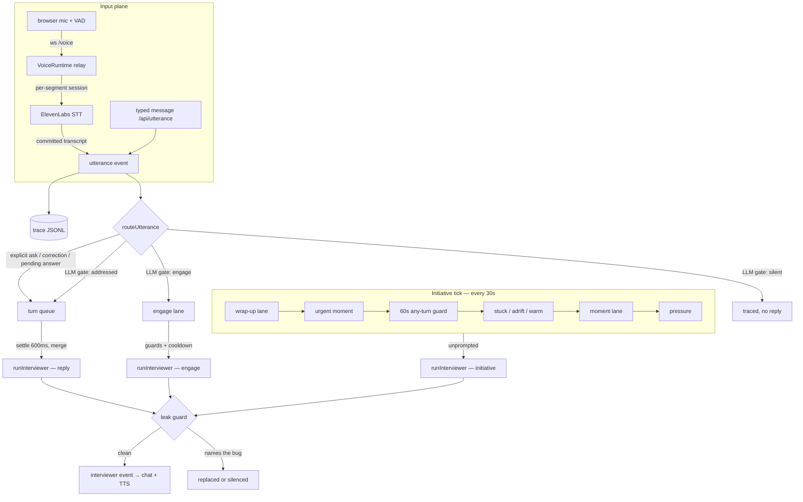

# The interviewer loop, end to end

How the live interviewer works in a session: every input path, every routing
decision, every clock, and every way the interviewer can decide to speak —
from the opening turn to the sign-off. This is the companion to
`docs/problem-generation.md`: that doc explains how a round is *built*, this
one explains how it is *run*.

The code lives in `server/src/session.ts` (the loop and its clocks),
`server/src/interviewer.ts` (the agent, the intent gate, the leak guard),
`server/src/addressing.ts` (deterministic routing), `server/src/voice.ts`
(the speech relay), and the pure detectors it consults: `stuck.ts`,
`adrift.ts`, `moments.ts`, `agenda.ts`, `wrapup.ts`, `ack.ts`. Every
detector is pure and stateless over the trace — no I/O, no clock reads,
`nowMs` injected — so a session restart forgets nothing and replay is
deterministic.

## The shape of the whole thing

Three planes, one voice. Inputs become trace events and maybe a reply;
an independent 30-second tick gives the interviewer initiative; everything
that would be spoken passes one mechanical leak guard on the way out.
`interviewerBusy` is a single lock across all three planes — one voice at a
time, no overlapping turns.

## 0. Boot: does this round even have an interviewer?

`resolveRoundSpec(problem).capabilities` decides everything. If
`interviewer: false` (solo rounds, OAs), none of this file applies: there is
no mic in any circumstance (`voiceOffReasonFor` — the mic exists iff someone
is listening), `/api/utterance` returns 409 so nothing can plant
talk-evidence in the trace, and the only "turns" are the hard time cap's
notices. With an interviewer, voice additionally needs `ELEVENLABS_API_KEY`
and `IP_VOICE≠0`; absent either, the round runs text-only and the header
chip names the reason.

The **opening turn** fires once at candidate arrival: a composed
introduction of the round (spec framing, how to run tests, time rules). It
rides its own prompt slot — kind `answer`, `nudge: false` — because the
agenda derives "did they clarify?" from prompted answer-turns and a
mislabeled opening corrupted it once.

## 1. Input plane: how words become events

**Voice.** The browser does VAD locally and streams
`speech_start / audio chunks / speech_end` over one WebSocket to the
session's `VoiceRuntime`. The relay opens a **fresh ElevenLabs session per
segment** (a long-lived one once went silently half-dead for 11 straight
segments); audio arriving before the vendor socket opens is buffered, never
raw-sent (a raw send on a CONNECTING socket once ate whole segments). On
`speech_end` the relay commits; a watchdog records the segment as
`untranscribed` if the commit draws no response, so a hung vendor session
never silently swallows words. The utterance event is **stamped at speech
start**, never transcript arrival — arrival stamps would shift every
utterance by the STT round trip and corrupt all gap arithmetic.

Two sensors ride the same trace (`presence` = browser energy gate, `stt` =
relay upstream), so contamination is derivable from the record itself. A
per-session budget caps vendor spend; at the cap, voice degrades to text
with the header saying so — never a silent mute.

**Text.** A typed message posts to `/api/utterance` and takes the *same*
path: traced, then routed. Typed and spoken words are indistinguishable
downstream.

## 2. Routing: who was that addressed to?

Every utterance goes through `routeUtterance` the moment it lands —
classification runs *outside* the reply lock, so narration never delays a
real question behind a busy interviewer.

Three deterministic fast paths run first. Each is deliberately narrow, and
each errs toward the model: a miss falls to the LLM gate, never to the
floor.

1. **`isExplicitAsk`** — ~20 regexes of second-person request shapes
   ("can you…", "help me", "is this valid…", "just to clarify…"). These are
   near-universal English request forms, not assumptions about anyone's
   speech habits.
2. **`isCorrectionFollowUp`** — starts with "no / nah / I mean…" within
   45s of an interviewer turn. You do not correct someone who was not
   talking to you.
3. **`isAnswerToPendingQuestion`** — the interviewer's most recent
   non-ack turn asked something (kind probe/pressure, a literal `?`, or
   `nudge: true`), it was within **60 seconds**, no other words have been
   said since, and this utterance is **≥ 8 words**. The floor is a pure
   word count, no filler lexicon — a vocabulary list inside a
   model-bypassing detector fails open for every speaker it didn't
   anticipate. (This detector walks a trace that already contains the
   utterance being classified, and skips itself exactly once.)

Everything else goes to the **LLM intent gate** (haiku, ~500ms), which
returns a three-way verdict:

- **`addressed`** → queue for a reply. The gate sees the last few turns, so
  it can route a bare "no" that answers the interviewer's question — judged
  in context, per speaker.
- **`engage`** → the utterance is thinking-aloud that *completed a
  substantive thought* (a theory, a claim, a result, a decision). See the
  engage lane below.
- **`silent`** → traced, no reply. The gate's standing bias: when in doubt,
  narration. A missed question costs a rephrase; a false reply interrupts
  someone mid-thought, which is worse than any latency number.

Addressed turns land in a small FIFO **turn queue** (cap 2, oldest drops —
the newest question is the one the candidate is waiting on). A **600ms
settle** window merges stragglers, then one reply answers the merged text.
The gate's failure is never silent: an errored intent check marks
`interviewer_fault`, which the header chip surfaces as
"interviewer: unavailable" instead of leaving the candidate to conclude
they're being ignored.

## 3. The reply turn: what the interviewer sees and says

`runInterviewer` takes the busy lock and assembles the context fresh each
turn: the file under the candidate's eyes (focus sensor), real diffs since
session start, the latest test output, the conversation transcript, and —
privately — the planted bug's ground truth. The evaluation **agenda**
(which dimensions still lack evidence) rides *unprompted turns only*; a
reply's job is the answer, and agenda-on-replies once bolted the same
follow-up question onto three consecutive replies in 43 seconds.

The model returns `{say, kind, nudge}`. Two things stand between that and
the candidate:

- **The leak guard** — `leaksBugLocation()` is mechanical and unit-tested:
  a reply naming the buggy file, its stem, or (for scaffolding turns)
  forbidden vocabulary never reaches the candidate, no matter what the
  model decided. Relaxations are principled: a file the *spec itself* names
  is public; territory the candidate has already visited may be discussed.
  A redacted reply becomes the redaction notice (prompted) or silence
  (unprompted — volunteering a decline out of nowhere is a tell).
- **The nudge flag** — `nudge: true` marks the candidate's following
  actions as prompted rather than self-directed, which keeps the progress
  record honest. Fails toward `true` when the model omits it.

Silence is a valid turn, but never an unexplained one: a deliberately
silent turn carries a logged reason; a reasonless silence is treated as the
failure shape it is.

Spoken replies also drive **TTS**: the audio is fetched from the *stored*
(post-guard) event, so there is no path from raw model output to the
speaker. A turn arriving mid-playback holds up to 1.2s (newest wins if
several stack); acks never interrupt a real turn.

## 4. Initiative: the 30-second tick

Replies are reactive. Everything the interviewer does *unprompted* comes
from one tick (`PRESSURE_TICK_MS = 30s`), which walks a strict priority
ladder and dispatches at most one turn per pass. Nothing fires until the
round is genuinely underway (a failing run, a first edit, or the floor
elapsing).

In order:

1. **Wrap signal, checked every tick and set once.** `detectWrapSignal`
   arms the wrap-up when the suite's latest run is green after a failure
   and has stood 60s, or the candidate said a done-phrase ("any other
   questions", a short trailing "anything else?") after real work started.
2. **The wrap-up lane** (if armed) *owns* initiative — no scaffolding, no
   moments, no pressure at work that is already done. It paces on its own
   30s guard plus a 15s candidate-quiet window (a talking candidate gets
   the next question through their reply instead — see below). It asks up
   to three evaluation questions chosen from the agenda's gaps
   (`selectWrapTopic`: reflect → approach → clarify-inverse → verify, then
   depth questions), then delivers the closing: one specific
   acknowledgment, and "that's everything from me — end whenever you're
   ready." After the closing the interviewer stays silent unless directly
   asked.
   **Reply-carried questions:** while the phase is open, every *reply* also
   carries the next evaluation question as a first-class assignment
   ("answer what they said, briefly, then ask"), and it counts only if the
   turn actually asked one. This exists because a wrap-phase candidate is
   rarely silent — in the session that forced the redesign, the phase armed
   and asked zero questions while the candidate ran their own wrap-up.
3. **Urgent moments.** The suite just went green — the climax of the
   round. Checked by its own detector (`detectUrgentMoment`: the green
   producers only, so a stale unfired moment can't mask the pass), on a
   short 20s anti-stack guard, bypassing the moment cadence entirely.
4. **The 60s any-turn guard.** Below this line, nothing speaks within 60s
   of *any* spoken turn. Anti-stacking only — replies deliberately do not
   buy the interviewer long-term silence (a single shared clock once
   produced zero unprompted turns in a 26-minute session).
5. **Scaffolding — help paced by need, not the metronome** (90s floor
   after the last exchange):
   - **Stuck** (`STUCK_CYCLES = 3` failed attempts in the same place): the
     unprompted turn becomes the scaffolding move — one observation, the
     candidate's own vocabulary only, one step closer, never the location.
     Two redacted compositions abandon the episode.
   - **Adrift** (sustained reading in a region that is *not* the answer):
     one redirect per session, and only with ground-truth knowledge to back
     it — no answer knowledge, no adrift lane at all. If the region *is*
     right, the **warm** inversion fires instead (encourage, never
     confirm), uncapped but cooled 3 minutes.
6. **The moment lane** (2.5min cadence on the unprompted clock): trace
   moments a real interviewer leans into, each firing once — the first
   failure read (45s of reading, no edits), an edit with no stated theory,
   the first fix's result, a pass after struggle, a re-run with nothing
   changed.
7. **Pressure** (5min cadence): the plain unprompted beat — scope checks,
   "what's your leading theory?", time checks on timed rounds only.

## 5. The engage lane: reacting to thinking-aloud

When the gate returns `engage`, the interviewer may react to the *content*
of narration — sharpen a theory, challenge a claim with the candidate's own
evidence, receive a result — under hard limits: one or two sentences, never
confirm or deny a theory about the cause (confirming is the answer leaking;
denying narrows the field), and silence stays valid.

It is seasoning, never a metronome: no engagement within 45s of any spoken
turn, at most one per 2-minute cooldown (burned only when the turn actually
speaks), never while a reply is in flight or queued. During wrap-up an
engage-worthy thought gets the full reply treatment instead — the
conversation *is* the round there, and the reply carries the next wrap
question anyway.

## 6. Acks: proof of listening without a turn

Between substantive turns, a separate timer emits canned continuers
("Mm-hm.") so silence is never the interviewer's only state — a candidate
once asked "can you hear me?" four times at a working mic. Acks require 3+
narration utterances since the last one, a 90s minimum gap, cap at 8 per
session, never fire during wrap-up (a checked-out "Mm-hm" from someone
supposedly leading reads wrong), and deliberately touch none of the pacing
clocks — they never delay or replace a real turn.

## 7. The ending

Three ways a session ends: the End button (the one graded path), the hard
time cap (anchored to candidate arrival, with a grace period before
server-side finalize), or a one-shot Submit (which is also the round's
single graded run). Finalize closes the voice session (frames from a
still-open tab must not append phantom utterances to an ended trace), then
hands the trace to the judge — where `solved` is derived from the graded
run on one-shot rounds, dimension clamps follow the surface, and the
feedback card renders from verified citations. From there on it's
`judge.ts`'s story, not this one.

## The clocks, in one place

| Constant | Value | What it paces |
| --- | --- | --- |
| `SETTLE_MS` | 600ms | merge stragglers before a reply |
| `PRESSURE_TICK_MS` | 30s | the initiative tick itself |
| `ANY_TURN_GUARD_MS` | 60s | anti-stacking for lanes below wrap/urgent |
| `SCAFFOLD_FLOOR_MS` | 90s | stuck/adrift after the last exchange |
| `MOMENT_INTERVAL_MS` | 2.5min | moment lane, unprompted clock |
| `PRESSURE_INTERVAL_MS` | 5min | pressure lane, unprompted clock |
| `URGENT_MOMENT_GUARD_MS` | 20s | green-run reaction anti-stack |
| `WRAP_GREEN_DELAY_MS` | 60s | green must stand before wrap arms |
| `WRAP_TURN_GUARD_MS` | 30s | wrap lane's own pacing |
| `WRAP_CANDIDATE_QUIET_MS` | 15s | wrap lane waits for speech-free air |
| `WRAP_UP_QUESTIONS` | 3 | evaluation questions before the closing |
| `ENGAGE_GUARD_MS` / `ENGAGE_COOLDOWN_MS` | 45s / 2min | engage lane pacing |
| `PENDING_QUESTION_WINDOW_MS` | 60s | how long a question stays pending |
| `MIN_ANSWER_WORDS` | 8 | substance floor on the answer fast path |
| `CORRECTION_WINDOW_MS` | 45s | "no, I mean…" after a turn |
| `ACK_MIN_GAP_MS` / `ACK_SESSION_CAP` | 90s / 8 | continuer pacing |
| `STUCK_CYCLES` | 3 | attempts before scaffolding |
| `HOLD_CAP_MS` | 1.2s | TTS hold before newest turn plays |

## Design record: the incidents that shaped this

- **sess-1785962737985** — three unambiguous asks classified as narration
  and silently dropped; a correction got four minutes of silence. Origin of
  the deterministic fast paths, reasoned silences, and the moments system.
- **sess-qa814-leak** — a complete root-cause answer to a direct question
  read as narration for 190s. Origin of `isAnswerToPendingQuestion`; also
  the reply-composition rules ("a reply's job is the answer").
- **sess-1786220758002** — the candidate finished, asked "any other
  questions?" twice, and the round just stopped. Origin of the wrap-up.
- **sess-1786861469215** — wrap-up armed but never spoke: every polite
  check-in reset the 60s guard until the candidate ran their own ending.
  Origin of the wrap lane's own pacing, reply-carried questions, and the
  engage verdict (a stated hypothesis deserved better than "Mm-hm").
- **sess-1786924315899** — the resurrected answer fast path (it had been
  dead code via a self-inclusion bug) claimed every breath after any
  questioning turn: 26 turns, gaps down to 1 second. Origin of the
  substance floor and the 60s window.
- **sess-1786948725100** — a slow speaker's clause-sized segments each
  cleared the floor; 10 of 12 turns ended in questions; the candidate quit
  at 5.4 minutes without ever running the suite. Open at time of writing —
  proposed: speech-aware settle (reply only after real silence), a
  once-per-exchange claim on the answer fast path, a question-density
  governor, a gate carve-out for fillers, and respect for "don't tell me".

The through-line of every incident: deterministic paths are reserved for
shapes where precision is near-certain (our own vocabulary, event
structure, near-universal request forms), and everything about *how a
particular human talks* belongs to the model, which sees context. When a
deterministic path makes an assertion about speech habits, it eventually
meets a speaker it didn't anticipate.
